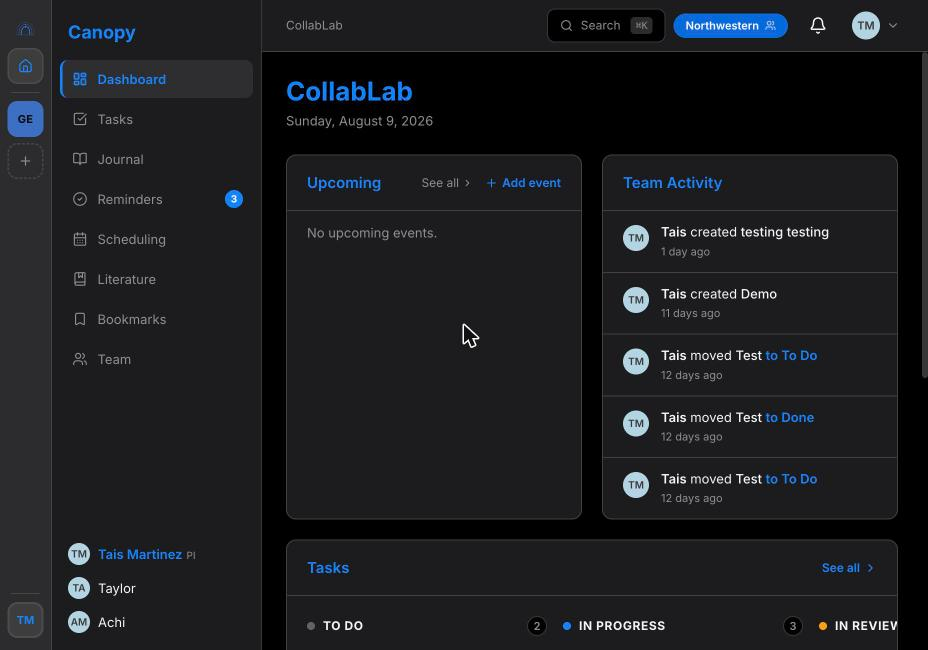
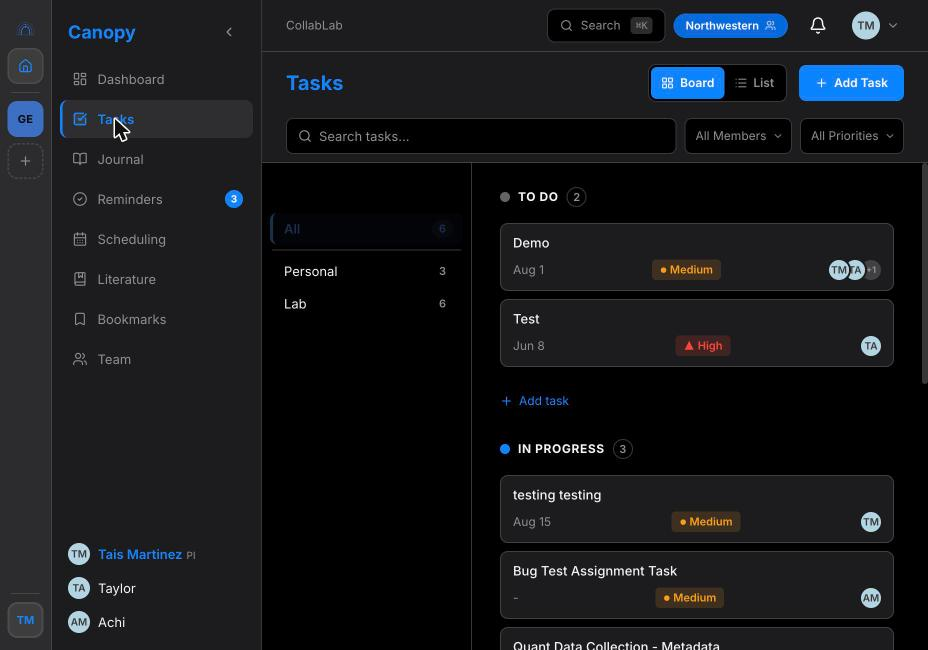
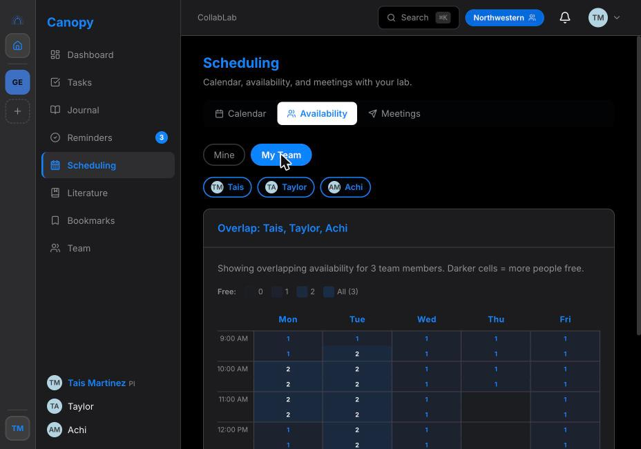
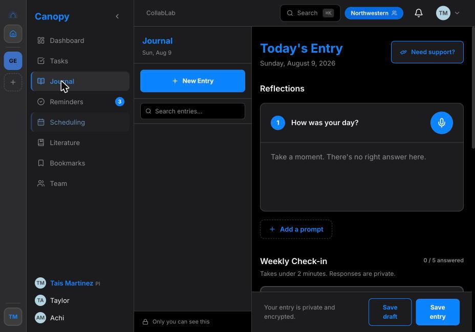

# Canopy

A research lab management platform built for trauma, psychology, and sensitive-population research teams. Canopy replaces the scattered collection of Slack threads, email chains, and spreadsheets that most labs rely on — bringing tasks, scheduling, journaling, and literature into one privacy-respecting tool.

Live app: [canopy-tawny-six.vercel.app](https://canopy-tawny-six.vercel.app)

## Screenshots

**Dashboard** — daily overview of upcoming events, team activity, and task status

**Tasks** — Kanban board across the research lifecycle

**Scheduling** — team availability heat map showing overlap across members

**Journal** — private, encrypted weekly check-ins and reflective prompts

## Product context

Research teams working with vulnerable populations (trauma survivors and other sensitive-population studies) were coordinating tasks, scheduling, and emotional check-ins across tools that were never built to protect participant or researcher privacy. Before writing any code, I ran 2 contextual inquiries and a competitive analysis to understand how these teams actually worked day to day, then designed the product privacy-first from the start rather than bolting privacy on later.

I built and shipped an MVP, then iterated based on usability testing with real users. Canopy is now live and continuously deployed (154+ deployments), and I'm currently leading an IRB submission for a 20+ participant study to formally evaluate it with research teams.

## Modules

**Tasks** — Kanban board for managing lab work across the full research lifecycle: protocol development, data collection, analysis, and publication. Supports drag-and-drop, priorities, assignees, due dates, file attachments, and real-time activity feeds.

**Scheduling** — Team availability coordination without the email back-and-forth. Members set their weekly availability on a simple grid (when2meet-style). The PI and team can see a live heat map of when everyone overlaps. Any member can propose a meeting time and invite others; invitees accept or decline in-app. Optionally sync with Google Calendar for automatic free/busy — event titles and details are never shared with anyone.

**Journal** — Private weekly check-ins and reflective prompts designed to help researchers process the emotional weight of sensitive fieldwork. The PI can suggest prompts but never sees individual responses.

**Literature** — A shared lab library for papers, books, and preprints. Tag, rate, annotate, and organize by collection. Supports both lab-wide and personal-scope items.

**Bookmarks** — Save and share links, resources, and references relevant to the lab's work.

**Team** — Member directory with weekly status updates and a real-time activity feed showing who moved what.

## Tech stack

- Framework: Next.js 15 (App Router)
- Database & Auth: Supabase (Postgres + Row-Level Security)
- Styling: CSS custom properties — no CSS framework, consistent design tokens throughout
- Drag & drop: @dnd-kit/core
- Icons: Lucide React
- Fonts: Lora (headings) + Roboto (UI)

## Design principles

- **Privacy first.** Researchers work with vulnerable populations. Personal calendar events are never visible to teammates. The PI sees only free/busy status — never what someone is doing, why they're blocked, or how they're feeling in their journal.
- **Internal-only scheduling.** There are no public booking links. Meeting proposals are between lab members only.
- **No noise.** The interface stays out of the way. One navy accent color, no gradients, no animations beyond what aids comprehension.
- **Prototype-ready.** Pages fall back to empty states (not mock data) when no database is connected, so UX can be validated in user studies before infrastructure is finalized.
